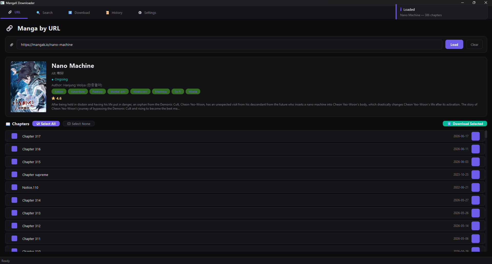

<div align="center">
  <br/>
  
  <br/>
  <h1>📥 MangaK Downloader</h1>
  <p>
    <strong>A full-featured manga downloader for <a href="https://mangak.io/">mangak.io</a></strong><br/>
    <em>Beautiful dark-themed GUI · Feature-rich CLI · Async concurrent downloads</em>
  </p>
  <p>
    <a href="https://github.com/Yui007/mangak-downloader"></a>
    <a href="#installation"></a>
    <a href="#license"></a>
    <br/>
    
    
    
    
  </p>
  <br/>
</div>

---

## ✨ Features

<table>
  <tr>
    <td width="50%">
      <h3>🔍 Search & Browse</h3>
      Find any manga with full metadata — rating, status, genres, tags, and authors. Genre filter chips, sort by relevance/rating/name.
    </td>
    <td width="50%">
      <h3>📖 Manga Details</h3>
      Complete detail view: cover image, summary, stats, author info, and full chapter list with select-all/download-selected controls.
    </td>
  </tr>
  <tr>
    <td>
      <h3>⬇️ Parallel Downloads</h3>
      Download multiple chapters simultaneously with configurable concurrency. Live progress bars for every chapter with page-by-page tracking.
    </td>
    <td>
      <h3>📦 Multiple Export Formats</h3>
      Export as CBZ, ZIP, PDF (page-fitted, no white borders), or raw webp image folder. Auto-cleanup images after export.
    </td>
  </tr>
  <tr>
    <td>
      <h3>🖥️ Dual Interface</h3>
      Beautiful <strong>PyQt6 dark GUI</strong> with glass panels, manga cards, progress rings, and toasts. Full-featured <strong>Typer + Rich CLI</strong> with interactive shell mode.
    </td>
    <td>
      <h3>🗃️ Download History</h3>
      SQLite-backed history with search, pagination, and stats. Every download recorded with format, size, and date.
    </td>
  </tr>
  <tr>
    <td>
      <h3>⚡ Optimized for Speed</h3>
      Async I/O with httpx, configurable parallel chapter + image downloads, smart resume (skips already-downloaded pages), rate-limit control.
    </td>
    <td>
      <h3>⚙️ Settings Everywhere</h3>
      Configure download directory, export format, concurrency, rate limiting, and cleanup — from both GUI settings tab and CLI commands.
    </td>
  </tr>
</table>

---

## 🚀 Quick Start

### Installation

```bash
# Clone the repository
git clone https://github.com/Yui007/mangak-downloader.git
cd mangak-downloader

# Install with pip (recommended)
pip install -e .

# Or with uv
uv pip install -e .

# Verify it works
mangak --version
```

### Launch the GUI

```bash
python -m mangak gui
# or
mangak-gui
```

### Or use the CLI

```bash
mangak interactive
```

---

## 📖 Usage

### 🖥️ CLI

```bash
# Show manga info
mangak info nano-machine

# Search for manga
mangak search "solo leveling" --limit 10

# Download chapters with range selection
mangak download nano-machine --chapters "1-10" --format cbz

# View download history
mangak history

# Change settings
mangak settings --set concurrent_downloads=8

# Interactive menu-driven shell
mangak interactive
```

### 🎨 GUI — Five Tabs

| Tab | Icon | Description |
|-----|------|-------------|
| **URL** | 🔗 | Paste a manga URL or slug, load full info + chapter list with checkboxes |
| **Search** | 🔍 | Search by name, filter by genre, browse results as manga cards |
| **Download** | ⬇️ | Active downloads with progress rings, pause/resume/cancel per item |
| **History** | 📜 | Searchable download history with stats and pagination |
| **Settings** | ⚙️ | All config options with save button — format, concurrency, cleanup |

### 💡 Tips

- **URL tab** accepts both `https://mangak.io/nano-machine` and plain `nano-machine`
- **Search** only runs when you click Search or press Enter — no auto-search on typing
- **Chapters** are auto-selected on load — use ☑ Select All / ☐ Select None
- **Download tab** shows "Converting..." during export and "Completed" when done
- **Settings** require clicking "💾 Save Settings" to persist

---

## 📦 Export Formats

| Format | Extension | Description |
|--------|-----------|-------------|
| `folder` | — | Raw `.webp` images organized in `manga/chapter/` directories |
| `cbz` | `.cbz` | Comic Book ZIP archive (compatible with CDisplayEx, YACReader) |
| `zip` | `.zip` | Standard ZIP archive with lossless compression |
| `pdf` | `.pdf` | Page-fitted PDF — each page sized to its image, no white borders |

---

## ⚙️ Settings Reference

Settings are persisted in `settings.json` in the project root:

| Setting | Default | Description |
|---------|---------|-------------|
| `download_dir` | `downloads` | Output directory for downloaded chapters |
| `export_format` | `cbz` | Default export format (cbz/pdf/zip/folder) |
| `concurrent_downloads` | `4` | Number of chapters to download simultaneously |
| `concurrent_image_downloads` | `4` | Number of pages to download simultaneously per chapter |
| `rate_limit_delay` | `0.25` | Delay in seconds between page requests |
| `delete_images_after_export` | `true` | Remove raw webp images after successful export |

---

## 🏗️ Architecture

```
mangak-downloader/
├── pyproject.toml                    # Project config & dependencies
├── settings.json                     # Runtime settings (auto-created)
├── downloads/                        # Default download directory
├── GUI.png                           # Screenshot for README
│
└── src/mangak/
    ├── __main__.py                   # Dual entry: CLI ↔ GUI routing
    │
    ├── core/                         # 🧠 Shared library
    │   ├── client.py                 # MangaKClient — async httpx API wrapper
    │   ├── config.py                 # Settings manager — JSON persistence
    │   ├── db.py                     # DownloadDB — SQLite history store
    │   ├── downloader.py             # DownloadQueue — async concurrent engine
    │   ├── exceptions.py             # Custom error hierarchy
    │   ├── export.py                 # Export pipeline (folder/CBZ/ZIP/PDF)
    │   ├── models.py                 # Pydantic v2 data models
    │   └── themes.py                 # Color palette & constants
    │
    ├── cli/                          # ⌨️ Typer + Rich CLI
    │   ├── app.py                    # Typer application & routing
    │   ├── display.py                # Rich table/panel builders
    │   ├── interactive.py            # Menu-driven interactive shell
    │   └── commands/
    │       ├── info.py               # mangak info
    │       ├── search.py             # mangak search
    │       ├── download.py           # mangak download
    │       ├── history.py            # mangak history
    │       └── settings.py           # mangak settings
    │
    └── gui/                          # 🎨 PyQt6 Dark GUI
        ├── app.py                    # MainWindow · 5-tab layout · status bar
        ├── themes.py                 # ThemeEngine — JSON→QSS token resolver
        ├── resources/
        │   ├── dark.json             # 18 color tokens
        │   └── dark.qss              # 734-line QSS stylesheet
        ├── widgets/
        │   ├── glass_panel.py        # Frosted glass QFrame
        │   ├── manga_card.py         # 180×260 cover card · hover lift
        │   ├── progress_ring.py      # Circular progress arc · purple→teal
        │   └── toast.py              # Slide-in notifications · 4 types
        └── tabs/
            ├── manga_url.py          # 🔗 URL tab — slug input + chapter list
            ├── manga_name.py         # 🔍 Search tab — genre filters + cards
            ├── download.py           # ⬇️ Download tab — active/queued/completed
            ├── history.py            # 📜 History tab — table + search + stats
            └── settings.py           # ⚙️ Settings tab — form + save button
```

---

## 🛠️ Tech Stack

| Layer | Technology |
|-------|-----------|
| **Language** | Python 3.10+ |
| **GUI** | PyQt6 — QTabWidget, QSS theming, QPropertyAnimation |
| **CLI** | Typer — subcommands, type coercion, autocomplete |
| **CLI Display** | Rich — Progress, Tables, Panels, Live |
| **HTTP** | httpx — async connection-pooled client |
| **Data Models** | Pydantic v2 — validation, coercion, `model_validate` |
| **Storage** | SQLite — download history via sqlite3 |
| **PDF** | img2pdf — lossless, page-fitted, no white borders |
| **Packaging** | pyproject.toml — pip/uv installable |

---

## 📄 License

```
MIT License

Copyright (c) 2026 Yui007

Permission is hereby granted, free of charge, to any person obtaining a copy
of this software and associated documentation files (the "Software"), to deal
in the Software without restriction, including without limitation the rights
to use, copy, modify, merge, publish, distribute, sublicense, and/or sell
copies of the Software, and to permit persons to whom the Software is
furnished to do so, subject to the following conditions:

The above copyright notice and this permission notice shall be included in all
copies or substantial portions of the Software.

THE SOFTWARE IS PROVIDED "AS IS", WITHOUT WARRANTY OF ANY KIND, EXPRESS OR
IMPLIED, INCLUDING BUT NOT LIMITED TO THE WARRANTIES OF MERCHANTABILITY,
FITNESS FOR A PARTICULAR PURPOSE AND NONINFRINGEMENT. IN NO EVENT SHALL THE
AUTHORS OR COPYRIGHT HOLDERS BE LIABLE FOR ANY CLAIM, DAMAGES OR OTHER
LIABILITY, WHETHER IN AN ACTION OF CONTRACT, TORT OR OTHERWISE, ARISING FROM,
OUT OF OR IN CONNECTION WITH THE SOFTWARE OR THE USE OR OTHER DEALINGS IN THE
SOFTWARE.
```

---

<div align="center">
  <sub>Built with ❤️ using Python · PyQt6 · Typer · Rich · httpx · Pydantic</sub>
  <br/>
  <sub>
    <a href="https://github.com/Yui007/mangak-downloader">GitHub</a> ·
    <a href="https://mangak.io/">mangak.io</a>
  </sub>
</div>
